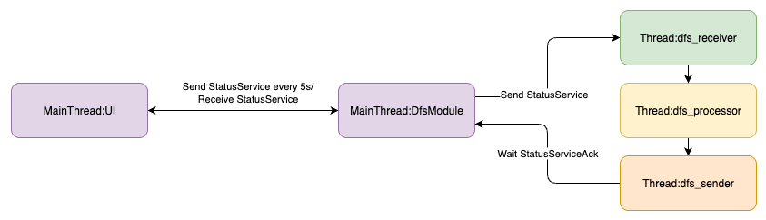
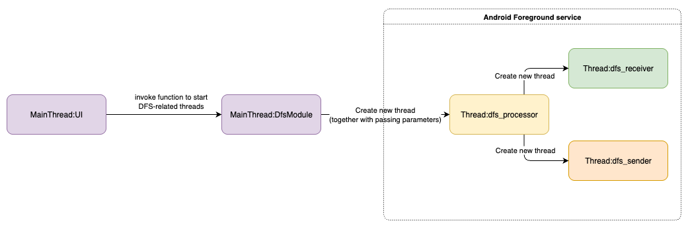
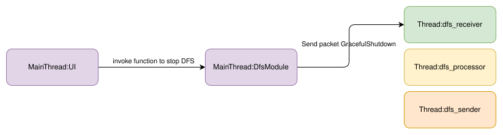
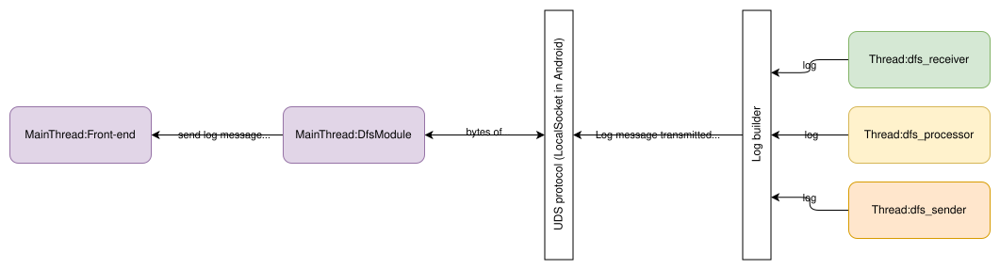

xButler app

# Feature

## Feat: Fetch DFS status

    

**_Front-end_** periodically invokes native function to fetch DFS status. **_Native module_** then sends health check packet to DFS service. DFS protocol is used, particularly packet `StatusService` and `StatusServiceAck`.

Periodic invocation in **_Front-end_** is done by hook `useInterval` with _5-second_ interval. Additionally, **_Front-end_** only runs this flow when the screen is DFS only.

## Feat: Start DFS with configuration

    

It uses Android service to run DFS in background and avoid termination when the app is idle. Inside service, app creates new thread to excute **_dfs_processor_** to avoid UI's being blocked.

DFS initialization allows configuration to set up the following:

- DNS ip and port
- Receive port of **_dfs_receiver_**

## Feat: Stop DFS

    

**_Front-end_** invokes a function in **_Native module_**, from which a DFS packet (`GracefulShutdown`) is sent to **_dfs_receiver_**. When this packet is processed **_dfs_processor_**, it trigger _Graceful shutdown_ procedure in DFS.

## Feat: Exchange log message between DFS and Front-end

    

**_Front-end_** invokes a function in **_Native module_**, from which a DFS packet (`GracefulShutdown`) is sent to **_dfs_receiver_**. When this packet is processed **_dfs_processor_**, it trigger _Graceful shutdown_ procedure in DFS.

When DFS has any log messages (from either receiver, processor or sender), those are formatted as Log instances. Log instances are converted into bytes to transmit to **_DfsModule_** via UDS protocol for fast message exchanging.

At **_DfsModule_**, a UDS server (use Coroutine) is hosted to receive incoming byte-encoded Log message. DfsModule decodes and transmits to **_Front-end_**.
